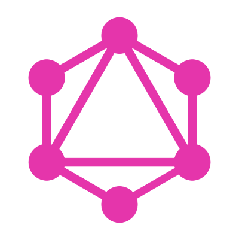
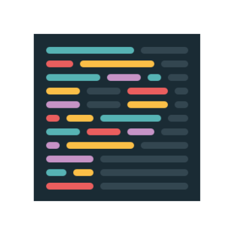

**⚠️ Please note: This project is still currently a work in progress and the first version has not yet been released. ⚠️**

# Ally Design System Starter Kit

<div>







</div>

## 👋 Introduction

The Ally Design System Starter Kit is built with Gatsby (v2) and Storybook (v6) with a custom project architecture inspired by Brad Frost's Atomic Design Methodology.

This starter kit aims to help create an enjoyable and productive developer experience for building Jamstack Design System based projects while prioritising Web Accessibility and Performance.

## 💨 Getting Started

### 1. **Make sure you have the Gatsby CLI installed.**

    If you don't already have the Gatsby CLI installed, install it using npm.

    ```shell
    npm install -g gatsby-cli
    ```

### 2. **Create a new project using this starter kit.**

    Use the Gatsby CLI to create a new project, specifying this starter.

    ```shell
    gatsby new your-new-projects-name https://github.com/ally-design-system/ally-design-system-starter-kit
    ```

### 3. **Change directories to your new project.**

    Navigate into your new project’s directory.

    ```shell
    cd your-new-projects-name
    ```

### 4. **Start developing.**

    Your now ready to start it up.

    There are three development environments to the Ally Design System Starter Kit:

    -   Gatsby powered site
    -   Storybook powered visual testing environment
    -   Storybook Docs powered design system

    Each of these has its own development command:

    To start developing the `Gatsby site` use:

    ```shell
    npm run dev-site
    ```

    For developing in `Storybook visual testing environment` use:

    ```shell
    npm run dev-story
    ```

    And for just developing the `Storybook Docs powered design system` use:

    ```shell
    npm run dev-design-system
    ```

    You can also have all three of these environments running simultaneously if needed.

### 5. **Open the source code and start editing!**

    After running `npm run dev-site` your Gatsby site will be served at `http://localhost:8008`.

    You'll also see a second link when running at `http://localhost:8008/___graphql` for GraphiQL.

    GraphiQL is a tool you can use to experiment with querying your data. Learn more about using this tool in the [Introducing GraphiQL Gatsby tutorial](https://www.gatsbyjs.org/tutorial/part-five/#introducing-graphiql).

    After running `npm run dev-story` your project's Storybook powered visual testing environment will open in your default browser at: `http://localhost:6006`.

    And `npm run dev-design-system` will run your design system powered by Storybook Docs in development mode at: `http://localhost:5005`.

### 6. **Building and Previewing Builds**

    Once happy with your project you can build your project using the following commands.

    To build the `Gatsby site`:

    ```shell
    npm run build-site
    ```

    To build the `Storybook powered visual testing environment`:

    ```shell
    npm run build-story
    ```

    To build the `Storybook Docs powered design system`:

    ```shell
    npm run build-design-system
    ```

    And then you can preview the builds using a local server:

    To serve the `Gatsby site` at `http://localhost:8080`:

    ```shell
    npm run serve-site
    ```

    To serve the `Storybook powered visual testing environment` at `http://localhost:8081`:

    ```shell
    npm run serve-story
    ```

    To serve the `Storybook Docs powered design system` at `http://localhost:8082`:

    ```shell
    npm run serve-design-system
    ```

## 🗺️ Kit Features

The starter kit will include:

-   An extended Atomic Design project architecture using Design Tokens.
-   A Storybook powered visual testing environment.
-   A Storybook Docs powered design system
-   Unit testing with Jest and CircleCI (This may not be included in the first version of the kit).
-   Sass powered Design Token maps and functions.
-   Nested Sass(Scss) using the BEM naming convention.
-   Markdown files as the content source for pages and posts by default but can be extended to use a CMS of choice.
-   Pre-built UI components including:
    -   `SEO` component.
    -   `SkipLink` component.
    -   `Header` component.
    -   Responsive `Menu` navigation component.
    -   `Footer` component.
    -   Default CSS-Grid `PageTemplate`.
    -   Default CSS-Grid `PostTemplate`.
    -   Possibly being extended with further base components in the future including a `Modal` component.

## 🎓 Learning Gatsby and Storybook

You can find loads of useful information about Gatsby from their very well-written documentation at: [gatsbyjs.org/docs](https://www.gatsbyjs.org/docs) and for information about Storybook head over to the Storybook docs at: [storybook.js.org/docs](https://storybook.js.org/docs/react/get-started/introduction).

## 🚀 Deployment

Ready to deploy your project and make it live?

**`Deploy to Netlify`**

[](https://app.netlify.com/start/deploy?repository=https://github.com/ally-design-system/ally-design-system-starter-kit)

**`Deploy to Vercel (formerly ZEIT Now)`**

[](https://zeit.co/import/project?template=https://github.com/ally-design-system/ally-design-system-starter-kit)
