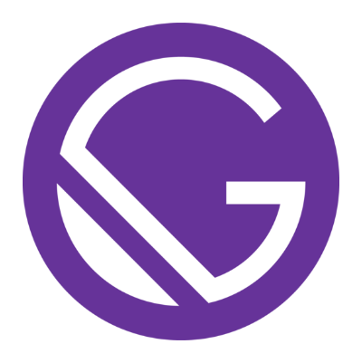

**⚠️ Please note: This project is still currently a work in progress and the first version has not yet been released. ⚠️**

# Ally Design System Starter Kit

<div>



</div>

## 👋 Introduction

The Ally Design System Starter Kit is built with Gatsby (v2) and Storybook (v5) with a custom project architecture inspired by Brad Frost's Atomic Design Methodology.

This starter kit aims to help create an enjoyable and productive developer experience for building Jamstack Design System based projects while prioritising Web Accessibility (A11Y) and Performance.

## 💨 Quick Start

1.  **Make sure you have the Gatsby CLI installed.**

    If you don't already have the Gatsby CLI installed, install it using npm.

    ```shell
    npm install -g gatsby-cli
    ```

2.  **Create a new project using this starter kit.**

    Use the Gatsby CLI to create a new project, specifying this starter.

    ```shell
    gatsby new your-new-projects-name https://github.com/ally-design-system/ally-design-system-starter-kit
    ```

3.  **Change directories to your new project.**

    Navigate into your new project’s directory.

    ```shell
    cd your-new-projects-name
    ```

4.  **Start developing.**

    Your now ready to start it up.
    Start the Gatsby development server first with `npm run dev` and then start Storybook by running `npm run story` in seperate terminal windows.

    ```shell
    npm run dev
    ```

    ```shell
    npm run story
    ```

5.  **Open the source code and start editing!**

    After running `npm run dev` your project will be served at `http://localhost:8008`.

    You'll also see a second link when running `npm run dev`: `http://localhost:8008/___graphql` for GraphiQL.

    GraphiQL is a tool you can use to experiment with querying your data. Learn more about using this tool in the [Introducing GraphiQL Gatsby tutorial](https://www.gatsbyjs.org/tutorial/part-five/#introducing-graphiql).

    After running `npm run story` your projects Storybook will open in your default browser at: `http://localhost:6006`.

    You can also run `npm run docs` just to view Storybook Docs only at: `http://localhost:5005`.

## 🗺️ Road Map

The starter kit will include:

-   An extended Atomic Design project architecture using 'Particles' (sub-atomic particles representing design tokens).
-   A Storybook (v6) powered UI Component Library (For UI presentation, visual testing and documentation).
-   Unit testing with Jest and CircleCI (This may not be included in the first version of the kit).
-   Nested Sass(Scss) with the Atomic BEM naming convention (an extended version of BEM including an atomic prefix which deals with modifiers more gracefully than the original BEM convention).
-   Markdown files as the content source for pages and posts by default but can be extended to use a CMS of choice.
-   Pre-built UI components including:
    -   `SEO` component.
    -   `SkipLink` component.
    -   `Header` component.
    -   Responsive `Menu` navigation component.
    -   `Footer` component.
    -   Default CSS-Grid `PageTemplate`.
    -   Default CSS-Grid `PostTemplate`.
    -   Possibly being extended with further base components in the future including a `Modal` component.

## 🎓 Learning Gatsby

Looking for more guidance?

You can find loads more information about Gatsby on their website: [gatsbyjs.org](https://www.gatsbyjs.org). They offer fantastic tutorials at: [gatsbyjs.org/tutorial](https://www.gatsbyjs.org/tutorial) and full, very well written documentation at: [gatsbyjs.org/docs](https://www.gatsbyjs.org/docs).

## 🚀 Deploy

Ready to deploy your project and make it live?

**`Deploy to Netlify`**

[](https://app.netlify.com/start/deploy?repository=https://github.com/ally-design-system/ally-design-system-starter-kit)

**`Deploy to Vercel (formerly ZEIT Now)`**

[](https://zeit.co/import/project?template=https://github.com/ally-design-system/ally-design-system-starter-kit)
